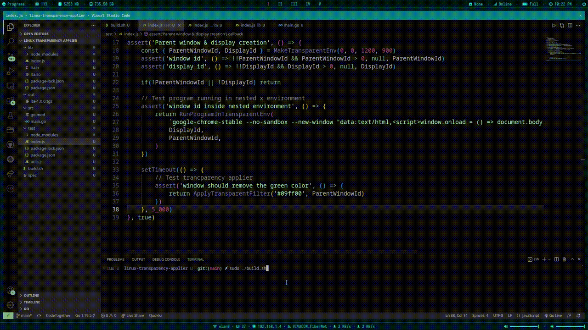

# linux-transparency-applier
A nodejs native module written fully in Go + node-ffi that makes it possible to apply a transparency filter to an application you're starting.

**DISCLAIMER**: Linux only. Xnest must be installed.

The following preview demonstrates this module making a specific green color transparent on a window by altering its shape
via Xlib. Note that, this will work for any pattern across the window, even if it's a small rectangle in the middle of the
window. The shape of the window will still be altered in such a way as to only exclude this portion of the panel.

